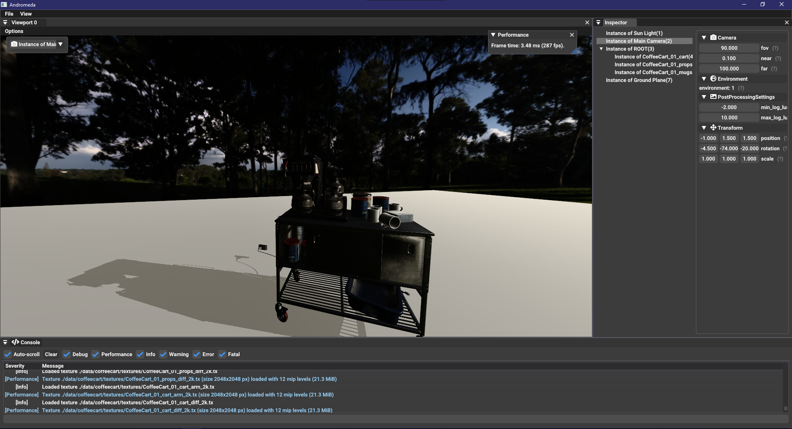
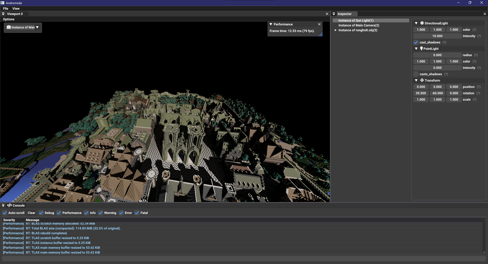

# Andromeda

Andromeda is a 3D scene editor with as main goal being easy to use and having beautiful visuals.
It features a Vulkan-powered rendering backend to get amazing graphics with good performance.

## Features

Some major features of the editor are listed here. For more detailed information and future additions
see the [roadmap](./Roadmap.md).

- PBR shading model with image based lighting.
- Culling of lights to allow for many lights in the scene.
- Raytraced shadows.
- Preprocessing assets into a fast binary format.
- Fast, asynchronous asset loading so the workflow is uninterrupted.
- Entity Component System for scene management.
  - Serializing and deserializing of entities into JSON.
  - Blueprint system to allow importing entities multiple times.

## Screenshots

*PBR materials with raytraced shadow in the editor*

*Large scene (~6 million triangles) rendered in the editor in realtime*